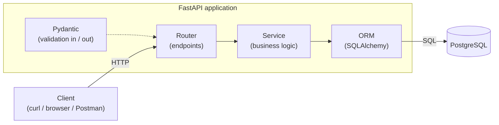

# Bookshelf API

[](https://github.com/dfelka/bookshelf-api/actions/workflows/ci.yml)
[](https://bookshelf-api-oyxn.onrender.com/docs)


A production-ready backend REST API for managing a bookstore inventory. The project demonstrates the full backend lifecycle: schema design, containerization, testing, CI/CD, cloud deployment, and documentation.

**Live demo:** <https://bookshelf-api-oyxn.onrender.com> — interactive API docs at [`/docs`](https://bookshelf-api-oyxn.onrender.com/docs).
_Hosted on Render's free tier, so the first request after a period of inactivity may take ~30–60s to wake._

## Features

- Full CRUD for books, with Pydantic input validation and structured error envelopes
- Pagination and filtering on the list endpoint (title search, author, completion status)
- Health-check (`GET /health`) and root metadata (`GET /`) endpoints
- Auto-generated interactive API docs (Swagger UI at `/docs`, ReDoc at `/redoc`)
- Dockerized local development (app + PostgreSQL via `docker compose`)
- Automated test suite (pytest, ~96% coverage) with CI via GitHub Actions
- Deployed to the cloud (Render) with a managed PostgreSQL database

> Authentication is intentionally out of scope for v1 — this is a public, read/write demo API.

## Tech Stack

| Layer            | Choice                   |
| ---------------- | ------------------------ |
| Language         | Python 3.12+             |
| Framework        | FastAPI                  |
| Database         | PostgreSQL 16            |
| ORM              | SQLAlchemy 2.0 + Alembic |
| Validation       | Pydantic v2              |
| Testing          | pytest + httpx           |
| Containerization | Docker + docker-compose  |
| CI/CD            | GitHub Actions           |
| Deployment       | Render (Docker) + managed PostgreSQL |

## Getting Started

### Run with Docker (recommended)

The whole stack — the API plus a PostgreSQL 16 database — runs with one command.
On startup the app container applies Alembic migrations and then launches the server.

```bash
docker compose up --build
```

- API: http://localhost:8000
- Interactive docs (Swagger UI): http://localhost:8000/docs
- Health check: http://localhost:8000/health

Stop the stack (containers only) with `docker compose down`, or
`docker compose down -v` to also drop the database volume.

### Run locally (without Docker)

Requires Python 3.12+ and a reachable PostgreSQL instance.

```bash
python -m venv .venv
source .venv/bin/activate        # Windows: .venv\Scripts\activate
pip install -r requirements.txt

cp .env.example .env             # then edit DATABASE_URL if needed
alembic upgrade head             # create the books table
uvicorn app.main:app --reload    # auto-docs at /docs
```

### Testing

The suite runs entirely against an in-memory SQLite database, so no Postgres
(or `psycopg2`) is required — just the app plus the test tools:

```bash
python -m venv .venv
.venv\Scripts\Activate.ps1        # Windows PowerShell
pip install fastapi sqlalchemy pydantic pydantic-settings pytest httpx pytest-cov

pytest                                       # all tests
pytest -v                                    # verbose
pytest --cov=app --cov-report=term-missing   # with coverage (currently 96%)
```

> On Python 3.12 you can instead `pip install -r requirements-dev.txt`.
> The explicit list above avoids the `psycopg2-binary` build, which has no
> wheel for newer Python versions on Windows and isn't needed for the tests.

### Linting & formatting

```bash
ruff check .     # lint (add --fix to auto-fix)
black .          # format (use --check in CI to verify without editing)
```

Configuration lives in `pyproject.toml`.

## Continuous Integration

Every push and pull request to `main` runs [`.github/workflows/ci.yml`](.github/workflows/ci.yml):

1. **Lint** — `ruff check .`
2. **Format check** — `black --check .`
3. **Tests** — `pytest` with coverage
4. **Docker build** — builds the image to confirm it still assembles

A green badge at the top of this README reflects the latest run on `main`.
Deployment is handled separately by Render's auto-deploy on push to `main`.

## Project Structure

```
bookshelf-api/
├── app/
│   ├── __init__.py
│   ├── main.py              # FastAPI app + error-envelope handlers
│   ├── config.py            # Settings via environment variables
│   ├── database.py          # DB engine, session, Base
│   ├── errors.py            # Domain exceptions (NotFound, Conflict, ...)
│   ├── models/              # SQLAlchemy table models
│   │   ├── __init__.py
│   │   └── book.py          # Book model
│   ├── schemas/             # Pydantic request/response schemas
│   │   ├── __init__.py
│   │   ├── book.py
│   │   └── common.py        # Data / list / error envelopes
│   ├── routers/             # Route handlers grouped by resource
│   │   ├── __init__.py
│   │   ├── health.py
│   │   └── books.py
│   └── services/            # Business logic (keeps routers thin)
│       ├── __init__.py
│       └── book_service.py
├── tests/                   # Test suite (pytest)
│   ├── conftest.py          # In-memory DB + TestClient fixtures
│   ├── test_book_service.py # Unit tests for the service layer
│   ├── test_books.py        # Integration tests for /books
│   ├── test_docs.py         # Docs endpoints (/docs, /redoc, /openapi.json)
│   ├── test_health.py       # Health-check test
│   └── test_root.py         # Root metadata endpoint test
├── alembic/                 # Database migrations
│   ├── env.py
│   └── versions/
│       └── 0001_initial.py
├── .github/
│   └── workflows/
│       └── ci.yml           # GitHub Actions: lint, test, docker build
├── alembic.ini
├── Dockerfile
├── docker-compose.yml
├── render.yaml              # Render Blueprint (web service + Postgres)
├── .dockerignore
├── pyproject.toml           # ruff + black configuration
├── pytest.ini
├── requirements.txt
├── requirements-dev.txt     # Test/dev deps (pytest, httpx, ruff, black, ...)
├── .env.example             # Template for environment variables
├── .gitignore
└── README.md
```

## Architecture



Request flow: **Client → Router (endpoint) → Service (logic) → ORM (database) → PostgreSQL.**
Routers stay thin; business logic lives in the service layer; Pydantic validates every request and response.

## Database Schema

```sql
CREATE TABLE books (
    id          SERIAL PRIMARY KEY,
    title       VARCHAR(200)  NOT NULL,
    author      VARCHAR(200),
    description TEXT,
    is_done     BOOLEAN       NOT NULL DEFAULT FALSE,
    created_at  TIMESTAMPTZ   NOT NULL DEFAULT NOW(),
    updated_at  TIMESTAMPTZ   NOT NULL DEFAULT NOW()
);
```

## API Reference

The full, interactive spec is auto-generated by FastAPI and always in sync with the code:

- **Live:** <https://bookshelf-api-oyxn.onrender.com/docs>
- **Local:** http://localhost:8000/docs (Swagger UI) · http://localhost:8000/redoc (ReDoc) · `/openapi.json` (raw spec)

### Endpoints

| Method   | Path            | Description                         | Success |
|----------|-----------------|-------------------------------------|---------|
| `GET`    | `/`             | API metadata + links                | `200`   |
| `GET`    | `/health`       | Health check                        | `200`   |
| `GET`    | `/books`        | List books (paginated, filterable)  | `200`   |
| `GET`    | `/books/{id}`   | Get a single book                   | `200`   |
| `POST`   | `/books`        | Create a book                       | `201`   |
| `PATCH`  | `/books/{id}`   | Update a book (partial)             | `200`   |
| `DELETE` | `/books/{id}`   | Delete a book                       | `204`   |

`GET /books` supports pagination and filtering — e.g. `GET /books?q=dune&is_done=false&per_page=5`.
See the [interactive docs](https://bookshelf-api-oyxn.onrender.com/docs) for the full list of query
parameters, request/response schemas, and per-endpoint status codes — it's generated from the code
and always current.

### Response envelopes

```jsonc
// Single resource
{ "data": { "id": 1, "title": "Dune", "author": "Frank Herbert", "is_done": false, ... } }

// Collection (paginated)
{ "data": [ ... ], "meta": { "page": 1, "per_page": 20, "total": 57 } }

// Error
{ "error": { "code": "NOT_FOUND", "message": "Book with id 99 not found" } }
```

## Contributing

Setup for new contributors:

```bash
git clone https://github.com/dfelka/bookshelf-api.git
cd bookshelf-api

python -m venv .venv
source .venv/bin/activate         # Windows PowerShell: .venv\Scripts\Activate.ps1
pip install -r requirements-dev.txt   # on Python 3.12; see Testing for the 3.14 note
```

Before opening a pull request, run the same checks CI does:

```bash
ruff check .        # lint
black --check .     # formatting
pytest              # tests
```

Workflow:

- Branch from `main` (e.g. `feat/…`, `fix/…`, `docs/…`).
- Use [Conventional Commits](https://www.conventionalcommits.org/) (`feat:`, `fix:`, `test:`, `docs:`, `chore:`).
- Open a PR — CI (lint + format + tests + Docker build) must pass before merge.
- Merging to `main` auto-deploys to Render.
